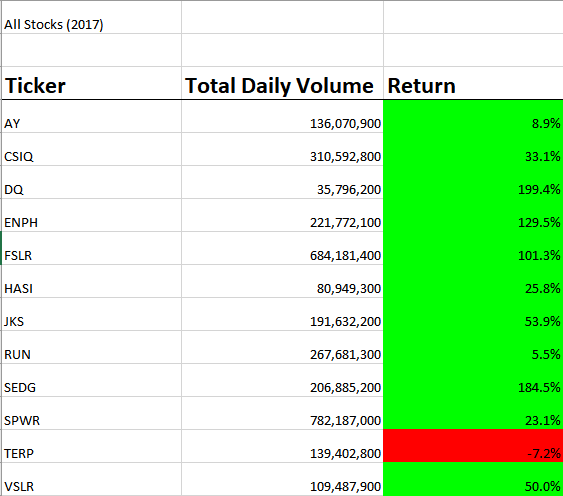
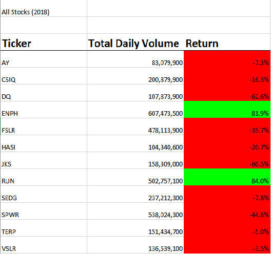

# stock-analysis
 Stock Analysis for Module 2

## Overview

The purpose of this project was to help our friend Steve analyze stock data to advise his parents' investing decisions.  To do this, we will use VBA to work with data on select stocks from 2017 and 2018.

## Results

Because DAQO was such a poor performer, Steve wants to examine several other stocks so as to protect his parents' savings.

### 2017 Results

In 2017 many of the selected stocks performed well.  Four of them had over one hundred percent returns while only one decreased in value compared to the start of the year.  If we only had this data to look at, we would at first be drawn to DQ, ENPH, FSLR, and SEDG for their triple digit growth.  CSIQ and JKS may also be considered as their prices increased significantly while being the third and seventh highest traded tickers.

### 2018 Results

2018 was much worse for these stocks, with only two producing positive returns, and only four more posting single digit negative returns.  Our selection is very volatile.  The only two positive returning stocks, ENPH and RUN, both increased over 80% in 2018.  Additionally, they were the first and third most traded stocks.  Both traded over 500,000,000 units, while most of our selection traded less than 250,000,000.

## Summary

### Advice to Steve

First, given the dramatic fluctuation in prices of these stocks, we would advise Steve and his family to exercise caution, since most of the stocks flipped from green to red in 2018.  ENPH was the standout of the group, increasing by 129.5% in 2017 and then by another 81.9% in 2018 on well over double the volume.  While RUN also increased both years, in 2017 its growth was only 5.5%.  Each of the other stocks had at least one negative year.  We would advise that out of this group, Steve and his family probably should choose ENPH to invest in.

### Advantages and Disadvantages of Refactoring Code

Refactoring code is very useful as it is a great way to find errors or redundancy in code.  Whether they wrote it or not one is able to improve on their skills by examining existing programs.  Additionally, it can help save time if code is refactored to be more efficient.  The code can also be made more robust to prevent errors and increase ease of use.  The only real disadvantage I can think of would be refactoring programs that do not have a long term use, as maximizing efficency is probably not that important if something only needs to run once.

### Advantages and Disadvantages for This Script

In our case, refactoring the code helped us use one index in combination with our arrays to compute volume and returns.  This was useful as the format we used would allow us or another use to later add more companies or years of data for further analysis.  Having "tickerIndex" as the index variable made the loops much clearer to interpret visually.  There were no real disadvantages other than having to type "tickerIndex" instead of "i".